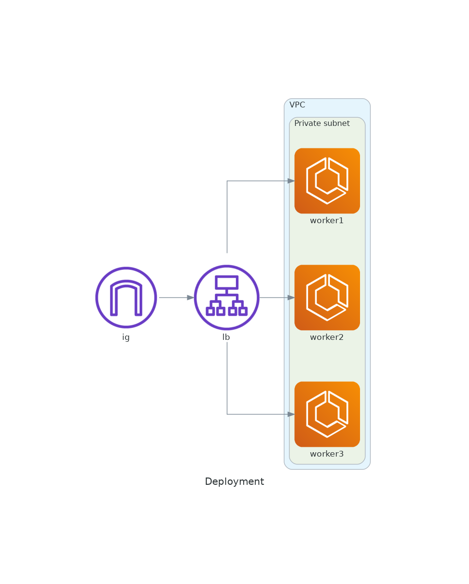

# Overview

This project automates the deployment of the `nginxdemos/hello` application on AWS using ECS (Elastic Container Service). The deployment is load balanced with ALB (Application Load Balancer) and ensures high availability through multi-AZ (Availability Zone) deployment. The infrastructure includes VPC (Virtual Private Cloud) setup with all required subnets. Workload runs on Fargate to reduce maintenance overhead. Instances have internet access via NAT gateway but can only be accessed through the load balancer. Additionally, CloudWatch log groups are created for log storage.
This project intentionally omits few important aspects which, if that was real life exmaple, would be added

I've conciously skipped certain features which in production would be implemented.

This deployment doesn't utilize TLS certificates nor does it require custom domain. It is possible to use self-signed certificate, or utilize custom domain name together with service like Let's Encrypt for TLS certificate.

Since application doesn't accept input from user, or utilizes databse, I skipped deployment of AWS WAF. In different circumstances I would definietly implement such feature to prevent malicious attacks i.e SQL injection.

I've decided not to implement any access log storage for LB, however I've left logic in code just as Proof of Concept.

# Deployment Instructions

- Ensure you have Terraform installed on your local machine.
- Clone this repository to your local machine.
- Navigate to the project directory in your terminal.
- Run `terraform init` to initialize the Terraform configuration.
- Run `terraform plan` to review the planned infrastructure changes.
- Run `terraform apply` to apply the Terraform configuration and deploy the infrastructure.
- Once deployment is complete, the ALB DNS name will be provided as an output. Access the application using this DNS name.
